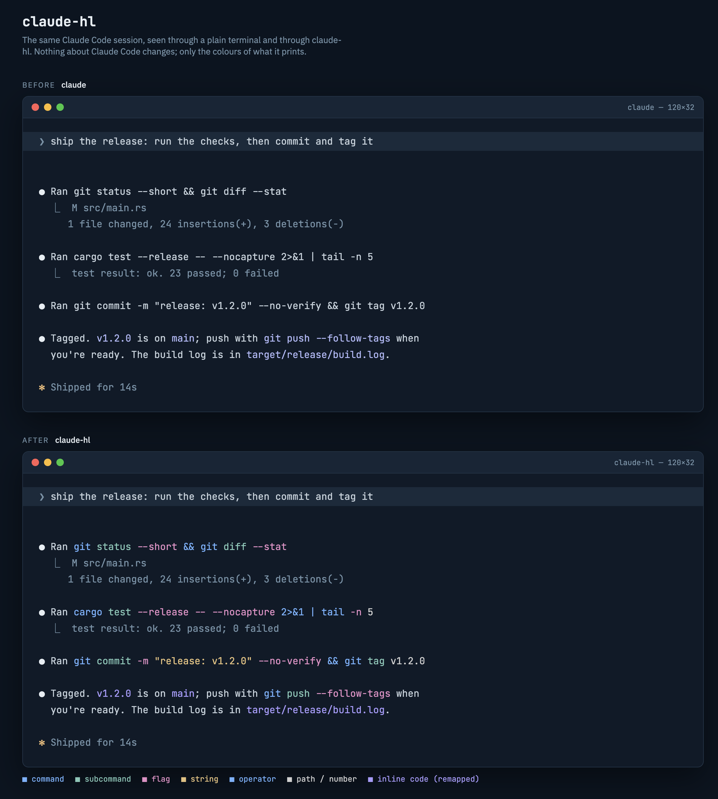

# claude-hl

Syntax colours for shell commands in Claude Code's output. Like Codex does it.



Claude Code shows inline commands in one flat colour. `git commit -m "fix" --no-verify`
is just a string. claude-hl sits between Claude Code and your terminal and paints
the command blue, the flags pink, the string gold. Claude Code itself runs
unchanged, so hooks, skills, MCP, permissions and `/rc` all keep working.

## Install

Needs a Rust toolchain ([rustup.rs](https://rustup.rs)).

```sh
cargo install --git https://github.com/rashedInt32/claude-hl
```

That drops `claude-hl` into `~/.cargo/bin`, which rustup already put on your
PATH. Or clone and build it yourself:

```sh
git clone https://github.com/rashedInt32/claude-hl
cd claude-hl
cargo build --release
cp target/release/claude-hl ~/.local/bin/
```

One dependency (`libc`), one 411 KB binary. Built and used on macOS; Linux should work but hasn't been tried.

## Use

```sh
claude-hl                  # instead of `claude`; any args pass straight through
claude-hl --resume abc123
```

That's it. There's nothing to configure.

## Tweak

| Variable | What it does |
|---|---|
| `CLAUDE_HL_THEME=rose` | Pick a palette: `codex` (default), `rose`, `catppuccin`, `tokyonight`, `dracula`, `gruvbox`, `nord` |
| `CLAUDE_HL_COLORS=cmd=89b4fa,num=fab387` | Override single slots of the theme. Slots: `cmd sub flag string path op num var url comment tool err warn ok` |
| `CLAUDE_HL_CODE_BG=2a2a3a` | Draw a background behind inline code, GitHub style. Off by default |
| `CLAUDE_HL_COMMANDS="bash sh -make"` | Grow the vocabulary without a rebuild. `word` adds a command, `word:sub` adds one that takes subcommands (`just:sub`), `-word` removes one |
| `CLAUDE_HL_CMD=codex` | Wrap a different program |
| `CLAUDE_HL_REMAP=b1b9f9=a99cff` | Recolour any exact foreground the app draws. Comma-separate pairs; empty disables |
| `CLAUDE_HL_DUMP=/tmp/hl.bin` | Append the raw PTY stream to a file, for bug reports |

`claude-hl --selftest` prints a sample so you can check colours without starting
Claude. `claude-hl --themes` prints that sample once per theme, so you can pick
one by eye. `claude-hl --version` prints the wrapper's own version; every other
argument goes to Claude.

### Why is there a remap at all?

Claude Code's inline code (`like this`) always uses the stock lavender, even
with a custom theme. The markdown renderer looks the theme up by name and never
sees your overrides. claude-hl already knows every cell's colour, so it swaps
that lavender for something that fits each theme. Set your own pair if you
disagree with the pick.

## Why not a custom frontend?

There are good ones. [claude-code-rust](https://github.com/srothgan/claude-code-rust)
is a Ratatui TUI over the Agent SDK with real syntax highlighting on real
markdown, and [toad](https://github.com/batrachianai/toad) does similar over
ACP. Editor integrations like CodeCompanion and Sidekick render Claude's
output inside a buffer where the editor's own highlighter takes over.

All of them replace the Claude CLI. That's the part I didn't want to give up.
The CLI is where hooks, skills, plugins, MCP servers, permission prompts, plan
mode, `/resume`, `/plugin`, Remote Control and every new feature land first. A
frontend has to re-implement each of those or live without it, and it's
always a release behind.

claude-hl is the other trade. It gives up knowing the markdown (it only sees
rendered ANSI) in exchange for changing nothing else. Claude Code runs exactly
as shipped; the wrapper just recolours what's already on screen. If one day
Claude Code colours inline commands itself, delete the binary and nothing
else changes.

## How it works

The child's output passes through byte for byte. Alongside, a small terminal
emulator mirrors the screen: cursor, cells, attributes, scroll regions, the
alternate screen. After each chunk, rows whose text changed are re-tokenised
and only the cells whose colour should differ get rewritten with an absolute
cursor move. Then the cursor and attributes are put back.

That design is what makes it stable. Claude Code streams a line in fragments
(`Ran git`, then ` status`, then ` --short`), and a byte-level filter can't
colour a fragment it can't see the start of. A screen model can.

Tokens it knows: command (bold), subcommand, flag (`--long`, `-s`, `-20`,
`+x`, `--key=` with its value painted separately), quoted string, operator
(`&& || | ; > >> < << 2>&1`), path and glob, number and version (`5`, `v1.2.0`,
`10s`), variable (`$HOME`, `$(pwd)`, `PORT=3000`), URL (underlined) and a
trailing `# comment`. Prefix runners chain: in `sudo systemctl restart nginx`
both words paint as commands, and so do `time`, `watch`, `env`, `xargs`.

Prose is the hard part. `make sure`, `go ahead` and `next step` are all valid
command shapes. The wrapper uses two signals a byte filter never sees. Claude
Code draws inline code in one fixed colour, so a command inside backticks is
trusted completely and the highlight stops where the code span stops. Tool
recaps start with `Ran`, so a command after that prefix is trusted too. Anywhere
else, a command only paints once a flag, path, string, number or operator turns
up; `git push --follow-tags` in a sentence paints, `git status` in a sentence
does not, and neither does `make sure the build passes`.

Beyond commands, a second pass paints what the first left alone:

- **Paths and URLs anywhere.** `target/release/build.log`, `~/.config/app.toml`,
  `README.md`, `.gitignore`, `https://docs.rs/libc`. A `src/main.rs:42:7`
  reference gets its line number in the number colour. Bare words need a known
  extension or a leading `/`, `./` or `~/`, so "and/or" and "e.g." stay plain.
- **Tool output.** Claude Code draws tool results in one flat gray. Inside that
  gray only, `error`, `FAILED` and `panicked` go red, `warning` yellow, `ok`,
  `passed` and `Done` green, numbers and durations (`23`, `0.42s`, `1.2k`) get
  the number colour, and `git status --short` codes paint by kind. The same
  words in Claude's prose are left alone.
- **Tool lines.** `⏺ Read(src/main.rs)`, `⏺ Bash(cargo test)`: the tool name
  in its own colour, the argument as a path or a command.
- **Chrome.** Box drawing and the `⎿` connector are dimmed when the app drew
  them in the default colour.

Repaints are cheap on the terminal side: tokens a few cells apart share one
cursor move and one SGR, and attributes are emitted as a single sequence.

## Limits

It reads rendered ANSI, not markdown. It can't know a fence's language, and it
recognises commands by vocabulary, so now and then a prose word gets painted,
or an unbackticked `git status` in a sentence stays plain. That's inherent to
the approach. If a real command is missed, add it with `CLAUDE_HL_COMMANDS`,
or to `COMMANDS` in `src/main.rs`. `cargo test` covers the tokenizer and the
screen model, so a vocabulary change is easy to check.

The palettes assume a dark background. Claude Code's light themes have no
matching palette yet.

## License

MIT
